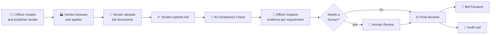
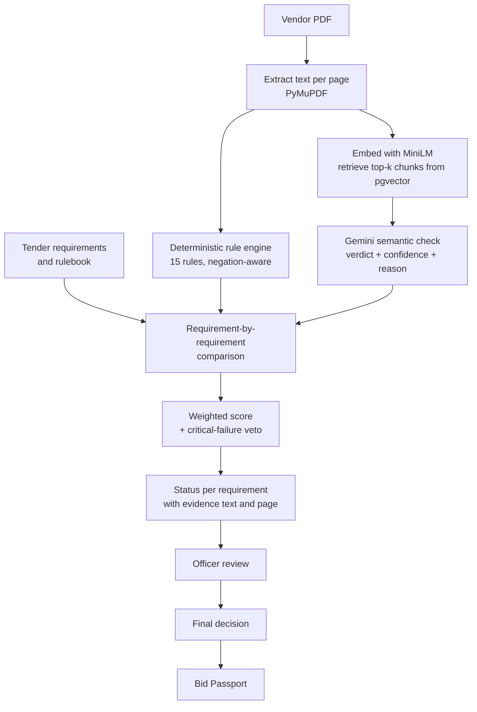
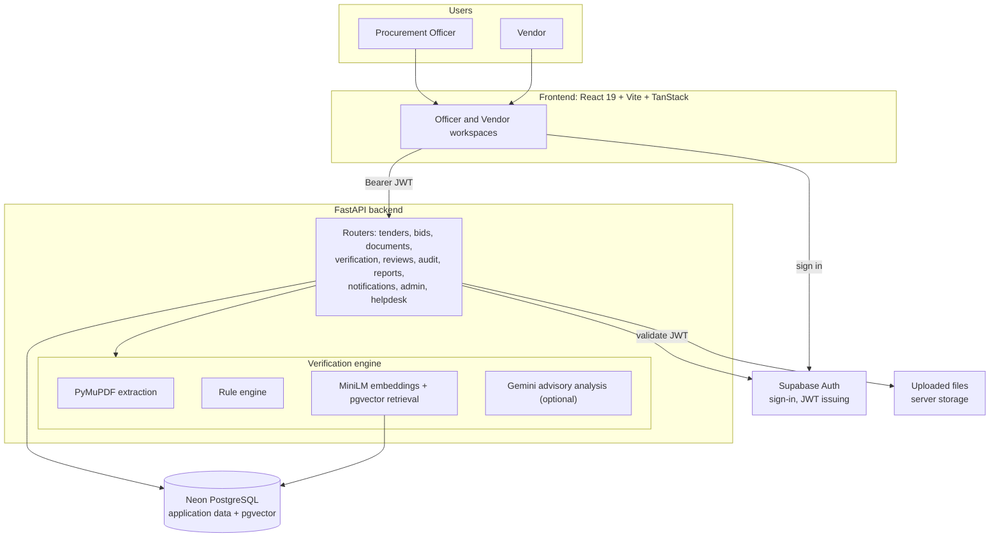

<div align="center">

<!--
  OPTIONAL BANNER
  Add a real banner to docs/assets/ and uncomment the line below.
  
-->

<div align="center">
  
</div>

### Evidence-Grounded Bid Verification for GeM Procurement

*AI-powered integrated bid compliance verification platform for Government e-Marketplace style procurement.*

<br>


<br>


<br>


<br>

> ### **No Evidence → No Decision.**

<br>

[Why GeMShield](#-why-gemshield) ·
[How it works](#-how-it-works) ·
[AI compliance](#-the-ai-compliance-check) ·
[Features](#-feature-showcase) ·
[Architecture](#-architecture) ·
[Getting started](#-getting-started) ·
[API](#-api-overview) ·
[Roadmap](#-roadmap--current-status)

</div>

---

## 📖 Overview

GeMShield is a bid verification platform for procurement officers and vendors. It does not stop at saying whether a bid is compliant. For every requirement it checks, it keeps a trail that answers:

- **What** requirement was checked?
- **What evidence** was found, and **where** (document and page)?
- Did it **match**? Was anything **missing** or **inconsistent**?
- **How confident** is the result, and does it need a **human**?

The intended model is deliberately not "AI decides":

```text
 Deterministic rules
   + Evidence retrieval (RAG)
   + Semantic analysis for uncertain cases
   + Confidence signals
   + Human review
 ────────────────────────────────────────
   = Officer decision
```

**AI is advisory. The procurement officer is the final authority.** A contradiction or a mismatch is a *review signal*, not proof of fraud, and GeMShield's output is a verification aid rather than a legally authoritative ruling.

This is a hackathon prototype (Smart India Hackathon, **SIH26100**, team **Debug Dynasty**), built as a real full-stack system. The [status section](#-roadmap--current-status) says plainly which parts are finished and which are not.

---

## 🎯 Why GeMShield?

Checking a bid by hand means opening a stack of PDFs, hunting for a GSTIN or an EMD receipt, and writing "OK" next to a checklist. The checklist says *that* something was checked, not *what was seen*.

| Principle | What it means in this project |
|---|---|
| **No Evidence → No Decision** | Every finding carries the matched text, its page, and an expected-versus-found comparison. A missing item is reported as **Not Found**, not silently skipped. |
| **Tender-Aware, Not Checklist-Aware** | Checks run against the tender in question (its documents are embedded and retrievable), not only a generic checklist. |
| **Contradiction-First** | The rule engine is negation-aware: a GSTIN that appears next to "not available" is *not* treated as a pass. |
| **Replayable Decisions** | Rule results, RAG verdicts, review actions, decisions and audit entries are persisted, so a decision can be traced back. |
| **Human-in-the-Loop** | Uncertain runs are referred to a review queue. Low-confidence AI output is never an automatic rejection. |

---

## 🧭 How it works

<div align="center">



</div>

<table>
<tr>
<td width="50%" valign="top">

### 🧑‍💼 Procurement officer

1. Sign in (officer accounts are role-gated)
2. Create a tender (staged form) and attach documents
3. Publish the tender
4. Review vendor submissions
5. Run **AI Compliance Check**
6. Inspect requirement-wise analysis, evidence and page references
7. Review missing or mismatched items and **AI Insights**
8. Refer uncertain runs to **Human Review**
9. Record the **final decision**
10. Issue a **Bid Passport**
11. Audit log keeps the trail

</td>
<td width="50%" valign="top">

### 🏭 Vendor

1. Sign in (vendor accounts)
2. Browse and filter published tenders, save favourites
3. Apply to a tender through a staged application
4. Upload bid documents (PDF)
5. Submit the bid
6. View compliance results and findings
7. View the Bid Passport, when one has been issued
8. Get notifications; ask the AI Help Desk or raise a ticket

</td>
</tr>
</table>

---

## 🔬 The AI Compliance Check

This is the core of the project. A run is started for one bid document and processed in the background.

<div align="center">



</div>

### What the pipeline actually does

1. **Extract.** PyMuPDF reads the PDF page by page, so every piece of evidence keeps its page number.
2. **Deterministic rules.** 15 rules from `rules.json` run first: keyword presence with validators (GSTIN format, PAN format, EMD with an amount, signatory) and numeric range checks (bid validity, annual turnover). Validators look for negation phrases such as *not provided*, *N/A* or *waiver* near the keyword.
3. **Retrieve.** The document is embedded with `all-MiniLM-L6-v2`, and the nearest rulebook/tender chunks are pulled from PostgreSQL with pgvector (top 5 by L2 distance).
4. **Reason where rules can't decide.** Gemini (when configured) is given the retrieved clauses plus the document excerpt and returns a verdict (`compliant`, `non_compliant`, `cannot_determine`), a confidence and a one-line reason. If Gemini is unavailable the run still completes, with `cannot_determine` results instead of a crash.
5. **Score.** Each rule is weighted by severity (critical 40, warning 15, info 5). The RAG layer can nudge the score by at most ±10 points.
6. **Verdict.** Any failed **critical** rule forces **Non-Compliant**. Otherwise a score of 85 or higher gives **Compliant**, and anything lower gives **Needs Review**.
7. **Hand off.** Results, evidence and audit entries are stored. The vendor is notified. The officer inspects and decides.

### Status vocabulary (as used by the code)

| Level | Values |
|---|---|
| Run verdict | `compliant` · `needs_review` · `non_compliant` |
| Requirement status in the UI | **Compliant** · **Needs Attention** · **Non-Compliant** · **Not Found** (`missing`) |
| Officer status on a run | Approved as Compliant · Marked for Human Review · Marked Non-Compliant · Clarification Requested |

<details>
<summary><b>📋 The 15 deterministic rules</b></summary>
<br>

| ID | Rule | Type |
|---|---|---|
| R001 | GSTIN Verification | keyword + validator |
| R002 | PAN Verification | keyword + validator |
| R003 | Bid Validity Period | value range |
| R004 | EMD / Earnest Money Deposit | keyword + validator |
| R005 | Authorised Signatory | keyword + validator |
| R006 | Annual Turnover | value range |
| R007 | Udyam / MSME Registration | keyword |
| R008 | Delivery Period | keyword |
| R009 | Make in India Compliance | keyword |
| R010 | Warranty / Guarantee | keyword |
| R011 | OEM Authorisation | keyword |
| R012 | Payment Terms | keyword |
| R013 | Technical Specifications | keyword |
| R014 | Past Performance / Experience | keyword |
| R015 | Compliance Certificates | keyword |

Rule sets can be versioned, edited as drafts and published from the officer **Rules** screen (`/api/admin/rules/versions`).

</details>

### The compliance screen

The officer view at `/officer/ai-compliance/:runId` is built for two modes of reading: a quick overview, and a deep requirement-level investigation.

- Overall compliance score as a circular gauge, plus summary cards (Compliant / Needs Attention / Non-Compliant / Total Requirements)
- Tabs: **Requirement-wise Analysis**, **Document-wise View**, **Missing / Mismatched Items**, **AI Insights**, **Review History**
- Per requirement: rule and severity, category, expected criteria, found value, status pill, and evidence with a clickable **page** reference
- Search and filters by category and status
- AI verdict, reason and confidence, with a clear "advisory only" note
- Actions to refer a run (or several) to Human Review, and to generate AI Insights

---

## 🧩 Core concepts

These are the names the project uses for its design ideas. Here is what each one is in practice, and how far along it is.

| Concept | What it is | Where it lives | Status |
|---|---|---|---|
| **Tender Digital Twin** | The tender as structured data: title, reference, department, category, estimated value, EMD, eligibility, closing date, plus its documents. Tender PDFs can be chunked and embedded so retrieval is tender-aware. | `routers/tenders.py`, `models.py`, `embed_tender.py` | 🟡 Partial. Structured fields and document embedding exist; automatic extraction of every requirement from a tender PDF into a rule set does not. |
| **Evidence Graph** | Each requirement result is linked to the matched text, page number and source document. | `rule_engine.py`, `RuleResult` table, requirement panel in the UI | 🟡 Partial. Links are per rule result, not a full graph across documents. |
| **Conflict Engine** | Detects "present but contradicted" and "absent" evidence, such as a GSTIN next to "not available". | negation handling in `rule_engine.py`, Gemini prompt rules | 🟡 Partial. Negation and missing-evidence detection work. A cross-document contradiction engine is not built. |
| **Confidence Gate** | Separates straightforward results from ones needing a person, using the 85 threshold, critical-failure veto and AI confidence. | `orchestrator.py`, `gemini_compliance.py` | 🟡 Partial. Officers refer runs to review; automatic queueing is not implemented. |
| **Bid Passport** | A stored snapshot of the bid, its decision and justification, with issuer and timestamp. | `/api/bid-passports/`, `BidPassport` table | 🟡 Partial. JSON snapshot, **not** cryptographically sealed. |

---

## ✨ Feature showcase

<!--
  GIF / SCREENSHOT SLOTS
  Record real clips of the running app and drop them in docs/assets/, then
  add a third column to the table below, for example:
  
-->

<table>
<tr>
<th width="32%">Feature</th>
<th>What it does, and where to find it</th>
</tr>
<tr>
<td><b>🗂️ Dual workspaces</b></td>
<td>Separate officer and vendor areas under <code>/officer/*</code> and <code>/vendor/*</code>. Roles are <code>admin</code>, <code>procurement_officer</code>, <code>reviewer</code> and <code>vendor</code>. The backend enforces role checks on sensitive routes.</td>
</tr>
<tr>
<td><b>🤖 AI Compliance Check</b></td>
<td>Rules, RAG and optional Gemini analysis, with an evidence-first results screen. Endpoints under <code>/api/verification-runs</code>.</td>
</tr>
<tr>
<td><b>📐 Rule management</b></td>
<td>Versioned rule sets: draft, edit, publish. Officers manage them without touching code. <code>/officer/rules</code>, <code>/api/admin/rules/versions</code>.</td>
</tr>
<tr>
<td><b>📑 Tender management</b></td>
<td>Staged tender creation, document upload, draft and publish status, vendor-side search with facets and saved tenders.</td>
</tr>
<tr>
<td><b>👥 Human review and decisions</b></td>
<td>Referred runs become review cases with priority and a recorded resolution. Final decisions are stored, and a bid's status follows the decision.</td>
</tr>
<tr>
<td><b>🛂 Bid Passport</b></td>
<td>Issued by an officer after a decision, visible to the vendor. Issuing one writes an audit entry.</td>
</tr>
<tr>
<td><b>📜 Audit and notifications</b></td>
<td>Audit log with filters and a detail view; per-user notifications with read and read-all.</td>
</tr>
<tr>
<td><b>📊 Reports</b></td>
<td>Overview, compliance, vendor performance, flags and trend endpoints feed the officer reports screen.</td>
</tr>
<tr>
<td><b>💬 AI Help Desk</b></td>
<td>Vendor help assistant plus support tickets (<code>/api/helpdesk</code>). Needs a Gemini key for answers.</td>
</tr>
<tr>
<td><b>🌐 Languages and themes</b></td>
<td>Eight interface languages (English, हिन्दी, मराठी, বাংলা, ગુજરાતી, தமிழ், తెలుగు, മലയാളം) and persistent light/dark themes.</td>
</tr>
</table>

### Application modules

<details>
<summary><b>🧑‍💼 Officer workspace</b> (routes present in the repo)</summary>
<br>

Dashboard · Tender creation (staged) · Tender management · Bids · AI Compliance Check (list and per-run view) · Human Review · Decisions · Reports · Vendors · Rules · Users · Audit Logs · Data Sources (data.gov.in) · Notifications · Help · Profile and settings

</details>

<details>
<summary><b>🏭 Vendor workspace</b> (routes present in the repo)</summary>
<br>

Dashboard · Find Tenders · Tender details · Tender application (staged) · My Bids and bid details · Compliance · Bid Passport · Notifications · Help (AI Help Desk) · Profile and settings

</details>

### UI philosophy

Government-oriented but modern: dense where an officer needs detail, plain where a vendor needs clarity. Status is always shown as a labelled pill, never colour alone. Evidence sits next to the claim it supports. The layout is responsive, and every AI output is labelled advisory.

---

## 🏗️ Architecture

<div align="center">



</div>

**Authentication and data are separate on purpose.** Supabase handles sign-in and issues JWTs. The FastAPI backend validates them (public-key verification via the project's JWKS endpoint) and resolves roles from its own database. **Business data lives in Neon PostgreSQL**, accessed through SQLAlchemy.

> **Note.** The repository also still contains an earlier Supabase-backed compliance path from the first prototype (`/api/compliance/run`, `supabase/migrations`, a legacy server-side engine file in the frontend). The Neon-backed `/api/verification-runs` flow described above is the main path.

---

## 🧰 Technology stack

| Layer | Technology |
|---|---|
| **Frontend** | React 19, Vite, TanStack Start / Router, TanStack Query, Tailwind CSS 4, shadcn/ui (Radix UI), Recharts, react-hook-form, zod, TypeScript |
| **Backend** | Python 3.12 (Docker image), FastAPI, Uvicorn, SQLAlchemy 2, Pydantic 2, httpx |
| **Database** | PostgreSQL on Neon, `pgvector` for embeddings |
| **Authentication** | Supabase Auth (email and password; Google sign-in wired in the UI) with JWT validation in FastAPI |
| **Documents and AI** | PyMuPDF, sentence-transformers (`all-MiniLM-L6-v2`), `google-genai` (Gemini, optional) |
| **Tooling** | Git and GitHub, ESLint, Prettier, Docker Compose files |

Versions come from `package.json` and `requirements.txt`; the backend pins minimums (`>=`), not exact versions.

---

## 🗂️ Project structure

```text
GeMShield/
├── backend-fastapi/
│   ├── main.py                  # app, CORS, router registration, legacy /upload + /jobs
│   ├── auth.py                  # Supabase JWT validation, role helpers
│   ├── models.py                # SQLAlchemy models (jobs, rules, bids, tenders, passports…)
│   ├── db.py                    # engine and session
│   ├── orchestrator.py          # extraction → rules → RAG → score → persist
│   ├── rule_engine.py           # deterministic, negation-aware checks
│   ├── rules.json               # the 15 base rules
│   ├── rag_engine.py            # MiniLM + pgvector retrieval + Gemini grounding
│   ├── gemini_compliance.py     # advisory semantic analysis (/api/compliance/analyze)
│   ├── document_processor.py    # PyMuPDF extraction, evidence page lookup
│   ├── helpdesk.py              # AI Help Desk + tickets
│   ├── data_gov.py              # data.gov.in search/import
│   ├── embed_rules.py           # seed rulebook embeddings
│   ├── embed_tender.py          # embed a tender PDF into the vector store
│   ├── seed_demo_users.py       # create local demo accounts
│   ├── routers/
│   │   ├── tenders.py  bids.py  documents.py  verification.py
│   │   ├── reviews.py  audit.py  notifications.py  reports.py
│   │   └── profiles.py  vendors.py  administration.py
│   ├── Dockerfile
│   └── requirements.txt
├── frontend/sure-tender-main/
│   ├── src/
│   │   ├── routes/              # file-based routes: _authenticated/officer, /vendor, auth, public pages
│   │   ├── components/          # compliance, layout, tenders, dashboard, auth, ui (shadcn)
│   │   ├── lib/                 # api-client, roles, theme, language, translations
│   │   └── integrations/supabase/
│   ├── supabase/migrations/     # early-prototype schema
│   ├── Dockerfile
│   └── package.json
├── references/                  # build spec, data.gov.in guide, flowchart, design references
├── docker-compose.yml
├── .env.example
├── BUILD_STATUS.md
└── README.md
```

The backend folder also holds a number of small one-off scripts (`test_*.py`, `alter_*.py`, `inspect_*.py`). They are development helpers, not a formal test suite.

---

## 🔌 API overview

Interactive docs are served by FastAPI at `/docs` once the backend is running. Routes are grouped by purpose; protected routes expect `Authorization: Bearer <Supabase JWT>`.

<details open>
<summary><b>Core workflow</b></summary>
<br>

| Prefix | Purpose | Notable routes |
|---|---|---|
| `/api/profiles` | Current user's profile | `GET/PUT /me`, `GET /` (staff), `GET /export` |
| `/api/vendors` | Vendor profile | `GET/PUT /me`, `GET /count` |
| `/api/tenders` | Tender lifecycle | `GET /` (search), `GET /facets`, `POST /`, `PUT /{id}`, `PUT /{id}/status`, `POST /{id}/documents`, saved tenders under `/saved` |
| `/api/bids` | Vendor bids | `POST /for-tender/{tender_id}`, `POST /{bid_id}/documents`, `POST /{bid_id}/submit`, `GET /by-tender/{tender_id}` |
| `/api/documents` | File access | `GET /bid/{bid_id}/files`, `GET /bid-file/{doc_id}/stream`, `GET /compliance-job/{job_id}/pdf` |

</details>

<details open>
<summary><b>Verification, review and decisions</b></summary>
<br>

| Prefix | Purpose | Notable routes |
|---|---|---|
| `/api/verification-runs` | AI Compliance Check | `POST ""` start a run for a bid document, `POST /upload`, `GET ""` list, `GET /{run_id}` detail with results, `POST /{run_id}/insights`, `POST /{run_id}/refer`, `POST /bulk-refer` |
| `/api/compliance` | Semantic analysis | `POST /analyze` (Gemini, advisory) |
| `/api/human-review-cases` | Review queue | `GET /`, `POST /{case_id}/action` |
| `/api/decisions` | Final decisions | `GET /`, `POST /`, `GET /{id}`; `GET /api/decision-candidates/` |
| `/api/bid-passports` | Bid Passport | `GET /`, `POST /` (officer), `GET /{id}` |

</details>

<details>
<summary><b>Administration, audit and support</b></summary>
<br>

| Prefix | Purpose | Notable routes |
|---|---|---|
| `/api/admin` | Staff administration | `/vendors`, `/users`, `/rules/versions` (list, create, patch, `/{id}/publish`) |
| `/api/audit` | Audit trail | `GET /`, `GET /me`, `GET /{id}`, `POST /` |
| `/api/notifications` | In-app notifications | `GET /`, `PUT /{id}/read`, `PUT /read-all` |
| `/api/reports` | Analytics | `/overview`, `/compliance`, `/vendor-performance`, `/flags`, `/trends`, `POST /custom` |
| `/api/helpdesk` | Vendor help | `POST /ask`, `POST /tickets`, `GET /tickets` |
| `/sources/data-gov` | data.gov.in | `/search`, `/resources/{id}`, `POST /import`, `/imports` |
| `/` and `/jobs` | Earlier standalone flow | `POST /upload`, `GET /jobs`, `GET /jobs/{id}/status`, `GET /jobs/{id}/results`, health check at `/` |

</details>

---

## 🔐 Security

- **Authenticated APIs.** Workflow routes require a valid Supabase-issued JWT.
- **Role-based access.** Roles are resolved server-side. Staff-only actions (publishing tenders, issuing passports, rule management) use role dependencies, and vendors can only act on bids they own.
- **Upload checks.** Bid uploads are PDF-only, with a type check, an empty-file check and a 20 MB limit. Stored filenames are sanitised and randomised.
- **Controlled document access.** Files are served through authenticated stream endpoints, not as a public folder.
- **Secrets come from the environment.** Database URLs, service keys, JWT secrets and Gemini keys belong in `.env` files that are git-ignored. Never commit them, and never paste them into issues or screenshots.
- **Honest limits.** CORS falls back to `*` if `FRONTEND_URL` is unset, which is fine for local development but should be set explicitly anywhere else. The project has not had a security review, so treat it as a prototype and not as production-hardened.

---

## 🚀 Getting started

### Prerequisites

- Node.js 20+ and npm
- Python 3.12 (matches the Docker image)
- A **Neon** PostgreSQL database with the `pgvector` extension available
- A **Supabase** project for authentication
- *Optional:* a Gemini API key (semantic analysis, AI Insights, Help Desk) and a data.gov.in API key

### 1. Clone

```bash
git clone YOUR_REPO_URL
cd GeMShield
```

### 2. Backend

```bash
cd backend-fastapi
python -m venv .venv
source .venv/bin/activate          # Windows: .venv\Scripts\activate
pip install -r requirements.txt

cp .env.example .env               # then fill in your own values (see table below)

python embed_rules.py              # seed rulebook embeddings used by retrieval
uvicorn main:app --reload --port 8000
```

Tables are created on startup. The first start downloads the MiniLM embedding model, so it needs internet access. Open `http://localhost:8000/docs` to confirm the API is up.

### 3. Frontend

```bash
cd frontend/sure-tender-main
npm install                        # add --legacy-peer-deps if npm reports peer conflicts
```

Create `frontend/sure-tender-main/.env`:

```env
VITE_SUPABASE_URL=YOUR_SUPABASE_URL
VITE_SUPABASE_PUBLISHABLE_KEY=YOUR_SUPABASE_KEY
VITE_API_URL=http://localhost:8000
```

```bash
npm run dev
```

Open **http://localhost:8080**.

### 4. Environment variables

| Variable | Used by | Purpose |
|---|---|---|
| `DATABASE_URL` | backend | Neon PostgreSQL connection string (`YOUR_DATABASE_URL`) |
| `SUPABASE_URL` | backend | Supabase project URL, used to fetch signing keys for JWT validation |
| `SUPABASE_JWT_SECRET` | backend | Listed in `.env.example` |
| `SUPABASE_SERVICE_ROLE_KEY` | backend (seed script) | Server-side key. Keep private. |
| `GEMINI_API_KEY` | backend | Enables semantic analysis, AI Insights and Help Desk (`YOUR_GEMINI_API_KEY`) |
| `GEMINI_MODEL` | backend | Gemini model name (the code defaults to `gemini-2.0-flash`) |
| `DATA_GOV_API_KEY` | backend | data.gov.in access |
| `FRONTEND_URL` | backend | Allowed CORS origin |
| `VITE_SUPABASE_URL` | frontend | Supabase project URL |
| `VITE_SUPABASE_PUBLISHABLE_KEY` | frontend | Supabase public (publishable) key |
| `VITE_API_URL` | frontend | Backend base URL (defaults to `http://localhost:8000`) |

### 5. Demo accounts

`backend-fastapi/seed_demo_users.py` creates two local accounts in your own Supabase project:

| Role | Email | Password |
|---|---|---|
| Admin / officer | `admin@gemshield.demo` | *set in the seed script* |
| Vendor | `vendor@gemshield.demo` | *set in the seed script* |

```bash
cd backend-fastapi
python seed_demo_users.py          # needs SUPABASE_URL and SUPABASE_SERVICE_ROLE_KEY
```

Change these before sharing any deployment. Officer sign-up through the UI is marked as pending authorised approval.

### Reference tender (optional)

GeMShield was exercised against a real tender document, `GTERE310_compressed.pdf`, as a reference for the compliance and RAG flows. The PDF is not part of the documented setup. To try tender-aware retrieval with your own tender, point `embed_tender.py` at a PDF you have and run it.

### Docker (experimental)

`docker-compose.yml` and per-service Dockerfiles are included, but they are **not verified end to end**. The frontend Dockerfile copies a `bun.lock` that is not in the repository snapshot, so expect to adjust it. For now, run the services locally as above.

---

## 🛣️ Roadmap / current status

**Legend:** ✅ implemented · 🟡 partial · 🔧 needs configuration · 🗓️ planned (not in the codebase yet)

### ✅ Completed

- Officer and vendor workspaces with role-gated routing
- Tender creation, publishing, search and saved tenders (FastAPI + Neon)
- Vendor bid application, document upload and submission
- 15-rule deterministic engine with negation-aware validators and per-page evidence
- MiniLM + pgvector retrieval and a scored, persisted compliance run
- Requirement-wise, document-wise, missing-items and review-history views
- Human review cases, final decisions, Bid Passport issuing
- Audit log, notifications, reports endpoints, versioned rule management
- Eight interface languages and light/dark themes

### 🔧 Depends on configuration

- **Gemini** semantic analysis, AI Insights and Help Desk need a valid key and quota. Without it, runs still complete and uncertain items come back as `cannot_determine`.
- **Google sign-in** is wired in the UI and needs provider setup in Supabase.
- **data.gov.in** import needs an API key. The channel exists but is not a complete integration.

### 🟡 In progress

- Finishing the end-to-end chain on a real submitted bid, from compliance run to decision to passport
- Moving the remaining frontend data access from the early Supabase prototype onto FastAPI
- Docker and deployment configuration
- RAG evidence precision: retrieval currently embeds the first part of the document and returns the top 5 chunks, so precision on long documents is limited

### 🗓️ Planned (not in the codebase yet)

- A cross-document contradiction engine, beyond negation and missing evidence
- Automatic extraction of requirements from tender PDFs into structured rules
- Automatic routing of low-confidence results into the review queue
- Tamper-evident (hash-sealed) Bid Passports
- DigiLocker sign-in (the button exists but shows "not configured")
- An automated test suite and CI
- A project licence

---

## 👥 Team and Author

**Debug Dynasty** · Smart India Hackathon, problem statement **SIH26100**

**Author** [SHRIJIT MUKHERJEE](https://github.com/INSANE0PAPA)

---

<div align="center">


<sub>Built by team Debug Dynasty for SIH26100.</sub>

</div>
